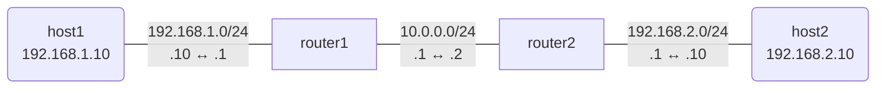

# Day 1: IPアドレスと疎通確認

## 学習目標

- IPアドレスとサブネットマスクの基本を理解する
- ping と traceroute で疎通確認ができるようになる
- VyOS の基本操作を習得する

---

## ネットワーク構成



| ホスト名 | インターフェース | IPアドレス |
|----------|-----------------|-----------|
| host1 | eth1 | 192.168.1.10/24 |
| router1 | eth1 | 192.168.1.1/24 |
| router1 | eth2 | 10.0.0.1/24 |
| router2 | eth1 | 10.0.0.2/24 |
| router2 | eth2 | 192.168.2.1/24 |
| host2 | eth1 | 192.168.2.10/24 |

---

## 事前知識: IPアドレスとサブネット

### IPアドレスとは

ネットワーク上の機器を識別するための番号（住所のようなもの）。
例: `192.168.1.10`

### サブネットマスクとは

IPアドレスのどこまでが「ネットワーク部」で、どこからが「ホスト部」かを示す。

```
IPアドレス:     192.168.1.10
サブネット:     255.255.255.0  (/24)
                ↓
ネットワーク部: 192.168.1     （同じネットワークに属する機器は共通）
ホスト部:       .10           （機器ごとに異なる）
```

### 同じネットワークとは

サブネットマスクで区切られたネットワーク部が同じ機器同士は「同じネットワーク」にいる。
同じネットワーク内では、ルーターなしで直接通信できる。

---

## ハンズオン

### Step 1: ラボを起動する

まず、完成版のトポロジでラボを起動します。

```bash
cd day1-ip-basics
sudo containerlab deploy -t topology.clab.yml
```

起動したら、ノードの状態を確認:
```bash
sudo containerlab inspect -t topology.clab.yml
```

### Step 2: VyOS にログインする

router1 にログインしてみましょう:
```bash
sudo docker exec -it clab-day1-ip-basics-router1 /bin/vbash
```

### Step 3: VyOS の基本操作を覚える

#### インターフェースを確認する

```bash
show interfaces
```

出力例:
```
Codes: S - State, L - Link, u - Up, D - Down, A - Admin Down
Interface        IP Address            S/L  Description
---------        ----------            ---  -----------
eth1             192.168.1.1/24        u/u
eth2             10.0.0.1/24           u/u
lo               127.0.0.1/8           u/u
```

#### ルーティングテーブルを確認する

```bash
show ip route
```

出力例:
```
S    192.168.2.0/24 [1/0] via 10.0.0.2, eth2
C    192.168.1.0/24 is directly connected, eth1
C    10.0.0.0/24 is directly connected, eth2
```

- `C` = Connected（直接接続されたネットワーク）
- `S` = Static（静的に設定したルート）

### Step 4: ping で疎通確認する

router1 から各機器に ping を打ってみましょう:

```bash
# 直接接続された host1 への ping
ping 192.168.1.10 count 3

# 隣の router2 への ping
ping 10.0.0.2 count 3

# router2 の向こう側にある host2 への ping
ping 192.168.2.10 count 3
```

### Step 5: traceroute で経路を確認する

host1 から host2 への経路を確認してみましょう。

router1 から `exit` で抜けてから、host1 にログインします:
```bash
sudo docker exec -it clab-day1-ip-basics-host1 /bin/sh
```

traceroute を実行:
```bash
traceroute 192.168.2.10
```

出力例:
```
traceroute to 192.168.2.10 (192.168.2.10), 30 hops max, 46 byte packets
 1  192.168.1.1 (192.168.1.1)  0.512 ms  0.341 ms  0.298 ms
 2  10.0.0.2 (10.0.0.2)  0.652 ms  0.421 ms  0.387 ms
 3  192.168.2.10 (192.168.2.10)  0.823 ms  0.612 ms  0.543 ms
```

→ host1 → router1 → router2 → host2 の順に経由していることがわかる

---

## 演習問題

### 問題: ルーターを自分で設定してみよう

完成版のラボを破棄して、演習用のラボを起動します:

```bash
sudo containerlab destroy -t topology.clab.yml
sudo containerlab deploy -t exercise.clab.yml
```

演習用ラボでは、ルーターの IP アドレスが設定されていません。
以下の手順で router1 と router2 を設定してください。

#### router1 の設定

```bash
sudo docker exec -it clab-day1-exercise-router1 /bin/vbash
```

設定モードに入る:
```bash
configure
```

IPアドレスを設定:
```bash
set interfaces ethernet eth1 address 192.168.1.1/24
set interfaces ethernet eth2 address 10.0.0.1/24
```

192.168.2.0/24 への経路を追加:
```bash
set protocols static route 192.168.2.0/24 next-hop 10.0.0.2
```

設定を反映:
```bash
commit
save
exit
```

#### router2 の設定

同様に router2 も設定してください（ヒント: IP アドレスの設計図を参照）

### 確認

host1 から host2 へ ping が通れば成功です:

```bash
sudo docker exec -it clab-day1-exercise-host1 ping -c 3 192.168.2.10
```

---

## まとめ

今日学んだこと:

1. **IPアドレス** = ネットワーク上の機器の住所
2. **サブネットマスク** = ネットワークの範囲を決める
3. **ping** = 通信できるか確認するコマンド
4. **traceroute** = どの経路を通っているか確認するコマンド
5. **VyOS の基本操作** = `configure` → `set` → `commit` → `save`

---

## クリーンアップ

ラボを終了する:
```bash
sudo containerlab destroy -t exercise.clab.yml
```
