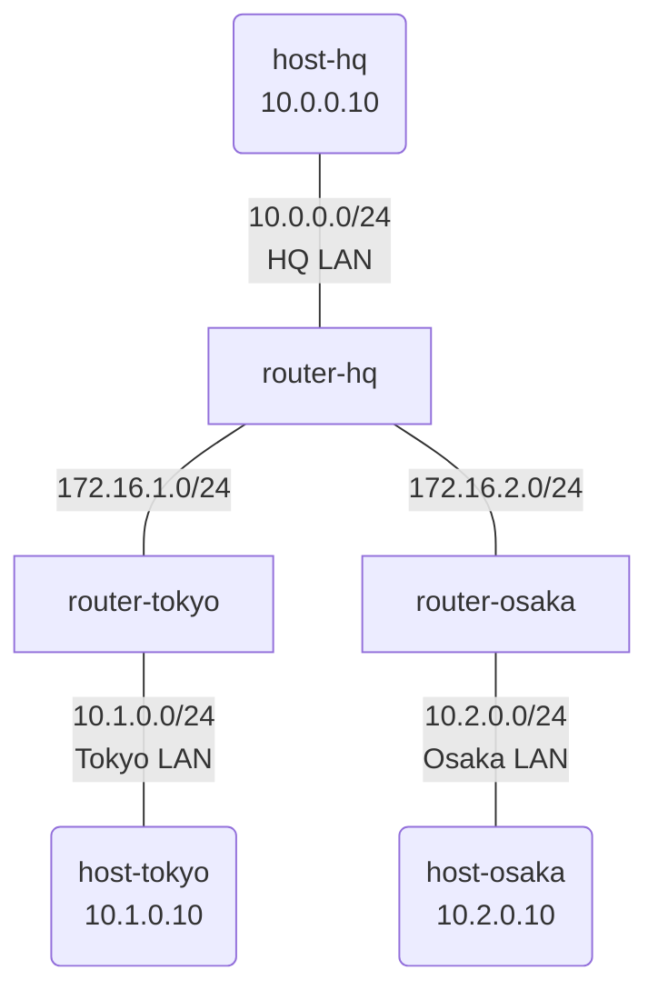

# Day 2: スタティックルーティング

## 学習目標

- ルーティングテーブルの読み方を理解する
- スタティックルート（静的経路）を設定できるようになる
- 3拠点構成でネットワーク設計を体験する

---

## ネットワーク構成

3つの拠点（本社・東京・大阪）を接続する構成です。



### IP アドレス設計

| ノード | インターフェース | IPアドレス | 接続先 |
|--------|-----------------|-----------|--------|
| host-hq | eth1 | 10.0.0.10/24 | HQ LAN |
| router-hq | eth1 | 10.0.0.1/24 | HQ LAN |
| router-hq | eth2 | 172.16.1.1/24 | Tokyo リンク |
| router-hq | eth3 | 172.16.2.1/24 | Osaka リンク |
| router-tokyo | eth1 | 172.16.1.2/24 | HQ リンク |
| router-tokyo | eth2 | 10.1.0.1/24 | Tokyo LAN |
| host-tokyo | eth1 | 10.1.0.10/24 | Tokyo LAN |
| router-osaka | eth1 | 172.16.2.2/24 | HQ リンク |
| router-osaka | eth2 | 10.2.0.1/24 | Osaka LAN |
| host-osaka | eth1 | 10.2.0.10/24 | Osaka LAN |

---

## 事前知識: ルーティングとは

### ルーティングテーブル

ルーターは「どの宛先に送るときは、どこに転送すればいいか」を表にして持っています。
これを**ルーティングテーブル**と呼びます。

```bash
show ip route
```

出力例:
```
S    10.1.0.0/24 [1/0] via 172.16.1.2, eth2
S    10.2.0.0/24 [1/0] via 172.16.2.2, eth3
C    10.0.0.0/24 is directly connected, eth1
C    172.16.1.0/24 is directly connected, eth2
C    172.16.2.0/24 is directly connected, eth3
```

### エントリの読み方

- `C` = **Connected**（直接接続）: そのルーターに直接つながっているネットワーク
- `S` = **Static**（静的経路）: 管理者が手動で設定した経路
- `via 172.16.1.2` = この宛先に送るには 172.16.1.2 に転送する（ネクストホップ）

### なぜスタティックルートが必要？

ルーターは直接接続されたネットワークしか最初から知りません。
遠くのネットワークへ到達するには、経路を教えてあげる必要があります。

---

## ハンズオン

### Step 1: ラボを起動する

完成版のトポロジでラボを起動します:

```bash
cd day2-static-routing
sudo containerlab deploy -t topology.clab.yml
```

### Step 2: ルーティングテーブルを確認する

router-hq にログインして、ルーティングテーブルを見てみましょう:

```bash
docker exec -it clab-day2-static-routing-router-hq /bin/vbash
```

```bash
show ip route
```

router-hq は以下を知っている必要があります:
- 10.0.0.0/24（HQ LAN）→ 直接接続
- 172.16.1.0/24（Tokyo リンク）→ 直接接続
- 172.16.2.0/24（Osaka リンク）→ 直接接続
- 10.1.0.0/24（Tokyo LAN）→ via 172.16.1.2
- 10.2.0.0/24（Osaka LAN）→ via 172.16.2.2

### Step 3: 各拠点間で疎通確認

router-hq から `exit` で抜けてから、host-hq にログインします:

```bash
docker exec -it clab-day2-static-routing-host-hq /bin/sh
```

```bash
# 東京拠点への ping
ping -c 3 10.1.0.10

# 大阪拠点への ping
ping -c 3 10.2.0.10
```

traceroute で経路を確認:
```bash
traceroute 10.1.0.10
```

### Step 4: 東京から大阪への通信

host-hq から `exit` で抜けてから、host-tokyo で traceroute を実行してみましょう:

```bash
docker exec -it clab-day2-static-routing-host-tokyo /bin/sh
traceroute 10.2.0.10
```

結果:
```
1  10.1.0.1 (router-tokyo)
2  172.16.1.1 (router-hq)
3  172.16.2.2 (router-osaka)
4  10.2.0.10 (host-osaka)
```

→ 東京から大阪へは、本社を経由して通信していることがわかる

---

## 演習問題

### 問題: 3拠点を接続してみよう

完成版を破棄して、演習用のラボを起動:

```bash
sudo containerlab destroy -t topology.clab.yml
sudo containerlab deploy -t exercise.clab.yml
```

演習用ラボではルーターの設定が入っていません。
以下を参考に、全拠点間で通信できるように設定してください。

### router-hq の設定

```bash
docker exec -it clab-day2-exercise-router-hq /bin/vbash
configure

# インターフェース設定
set interfaces ethernet eth1 address 10.0.0.1/24
set interfaces ethernet eth2 address 172.16.1.1/24
set interfaces ethernet eth3 address 172.16.2.1/24

# スタティックルート
set protocols static route 10.1.0.0/24 next-hop 172.16.1.2
set protocols static route 10.2.0.0/24 next-hop 172.16.2.2

commit
save
exit
```

### router-tokyo の設定

```bash
docker exec -it clab-day2-exercise-router-tokyo /bin/vbash
configure

# インターフェース設定
set interfaces ethernet eth1 address 172.16.1.2/24
set interfaces ethernet eth2 address 10.1.0.1/24

# スタティックルート
# ヒント: HQ と Osaka への経路が必要
# どちらも router-hq (172.16.1.1) を経由する
set protocols static route 10.0.0.0/24 next-hop 172.16.1.1
set protocols static route 10.2.0.0/24 next-hop 172.16.1.1

commit
save
exit
```

### router-osaka の設定

自分で考えて設定してみてください！

ヒント:
- eth1 は HQ との接続（172.16.2.0/24）
- eth2 は Osaka LAN（10.2.0.0/24）
- HQ LAN と Tokyo LAN への経路が必要

### 確認

すべての設定が完了したら、各拠点間で ping が通るか確認:

```bash
# HQ → Tokyo
docker exec -it clab-day2-exercise-host-hq ping -c 3 10.1.0.10

# HQ → Osaka
docker exec -it clab-day2-exercise-host-hq ping -c 3 10.2.0.10

# Tokyo → Osaka（最も遠い組み合わせ）
docker exec -it clab-day2-exercise-host-tokyo ping -c 3 10.2.0.10
```

---

## 発展課題

### デフォルトルートを使ってみよう

各拠点ルーターで、宛先を個別に指定する代わりに「それ以外は全部 HQ へ」という設定ができます。

```bash
# router-tokyo での例
configure
delete protocols static route 10.0.0.0/24
delete protocols static route 10.2.0.0/24
set protocols static route 0.0.0.0/0 next-hop 172.16.1.1
commit
```

`0.0.0.0/0` はすべての宛先を意味し、「デフォルトルート」と呼びます。

---

## まとめ

今日学んだこと:

1. **ルーティングテーブル** = ルーターの「地図」
2. **Connected (C)** = 直接接続されたネットワーク（自動で認識）
3. **Static (S)** = 管理者が手動で設定した経路
4. **next-hop** = 次に転送する先のルーターの IP
5. **デフォルトルート** = 「その他」の宛先をまとめて指定

スタティックルートの問題点:
- 拠点が増えると設定が大変
- リンクが切れても自動で迂回しない

→ Day 4 で学ぶ OSPF（動的ルーティング）で解決！

---

## クリーンアップ

```bash
sudo containerlab destroy -t exercise.clab.yml
```
