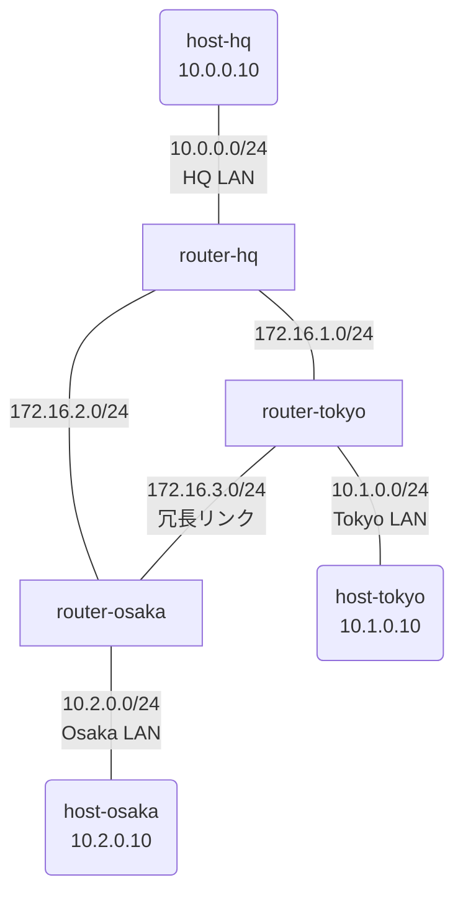

# Day 4: OSPF 入門

## 学習目標

- 動的ルーティングの必要性と利点を理解する
- OSPF の基本概念（Neighbor、Area、LSA）を学ぶ
- リンク障害時の自動迂回を体験する

---

## ネットワーク構成

Day 2 の 3 拠点構成に **冗長リンク（Tokyo - Osaka）** を追加した三角形トポロジです。



### IP アドレス設計

| ノード | インターフェース | IPアドレス | 接続先 |
|--------|-----------------|-----------|--------|
| host-hq | eth1 | 10.0.0.10/24 | HQ LAN |
| router-hq | eth1 | 10.0.0.1/24 | HQ LAN |
| router-hq | eth2 | 172.16.1.1/24 | Tokyo リンク |
| router-hq | eth3 | 172.16.2.1/24 | Osaka リンク |
| router-tokyo | eth1 | 172.16.1.2/24 | HQ リンク |
| router-tokyo | eth2 | 10.1.0.1/24 | Tokyo LAN |
| router-tokyo | eth3 | 172.16.3.1/24 | Osaka リンク |
| host-tokyo | eth1 | 10.1.0.10/24 | Tokyo LAN |
| router-osaka | eth1 | 172.16.2.2/24 | HQ リンク |
| router-osaka | eth2 | 10.2.0.1/24 | Osaka LAN |
| router-osaka | eth3 | 172.16.3.2/24 | Tokyo リンク |
| host-osaka | eth1 | 10.2.0.10/24 | Osaka LAN |

---

## 事前知識: 動的ルーティングとは

### スタティックルートの問題点

Day 2 で学んだスタティックルートには以下の問題があります:

1. **設定が大変**: 拠点が増えると経路の設定数が爆発
2. **障害に弱い**: リンクが切れても自動で迂回しない
3. **変更に弱い**: 構成変更のたびに全ルーターを再設定

### 動的ルーティングとは

ルーター同士が**自動で経路情報を交換**する仕組み。

メリット:
- 経路を自動学習（設定が楽）
- 障害時に自動迂回
- 構成変更に自動追従

### OSPF（Open Shortest Path First）

最も広く使われている動的ルーティングプロトコルの1つ。

- **リンクステート型**: ネットワーク全体の地図を共有
- **SPF アルゴリズム**: 最短経路を自動計算
- **高速収束**: 障害検知から数秒で迂回

---

## OSPF の基本概念

### 1. Neighbor（ネイバー）

OSPF を話す隣のルーター。Hello パケットを交換して関係を確立。

```
[Router-A] <-- Hello --> [Router-B]
    |                        |
    +--- OSPF Neighbor ------+
```

### 2. Area（エリア）

ルーターをグループ化する単位。今回はすべて **Area 0**（バックボーン）。

```
+------ Area 0 ------+
| R1 -- R2 -- R3     |
+--------------------+
```

### 3. LSA（Link State Advertisement）

ルーターが持つリンク情報。これを交換してネットワーク全体の地図を作る。

### 4. Router ID

OSPF でルーターを識別する ID。通常は IP アドレス形式（例: 1.1.1.1）。

---

## ハンズオン

### Step 1: ラボを起動する

完成版のトポロジを起動:

```bash
cd day4-ospf
sudo containerlab deploy -t topology.clab.yml
```

### Step 2: OSPF Neighbor を確認する

router-hq にログイン:

```bash
docker exec -it clab-day4-ospf-router-hq /bin/vbash
```

OSPF Neighbor を確認:

```bash
show ip ospf neighbor
```

出力例:
```
Neighbor ID     Pri State           Dead Time Address         Interface
2.2.2.2           1 Full/DR         00:00:38  172.16.1.2      eth2
3.3.3.3           1 Full/DR         00:00:35  172.16.2.2      eth3
```

→ router-tokyo (2.2.2.2) と router-osaka (3.3.3.3) が Neighbor になっている

### Step 3: ルーティングテーブルを確認する

```bash
show ip route
```

出力例:
```
O    10.1.0.0/24 [110/20] via 172.16.1.2, eth2, 00:05:32
O    10.2.0.0/24 [110/20] via 172.16.2.2, eth3, 00:05:32
C    10.0.0.0/24 is directly connected, eth1
O    172.16.3.0/24 [110/20] via 172.16.1.2, eth2, 00:05:32
                   [110/20] via 172.16.2.2, eth3, 00:05:32
C    172.16.1.0/24 is directly connected, eth2
C    172.16.2.0/24 is directly connected, eth3
```

- `O` = OSPF で学習した経路
- `[110/20]` = [AD/メトリック] AD=110 は OSPF のデフォルト

### Step 4: 疎通確認

router-hq から `exit` で抜けてから、host-hq にログインします:

```bash
docker exec -it clab-day4-ospf-host-hq /bin/sh
```

```bash
ping -c 3 10.1.0.10  # Tokyo
ping -c 3 10.2.0.10  # Osaka
```

traceroute で経路を確認:
```bash
traceroute 10.1.0.10
```

---

## 障害時の自動迂回を体験

### Step 5: 現在の経路を確認

host-hq から `exit` で抜けてから、host-tokyo にログインします:

```bash
docker exec -it clab-day4-ospf-host-tokyo /bin/sh
traceroute 10.2.0.10
```

結果（通常時）:
```
1  10.1.0.1 (router-tokyo)
2  172.16.3.2 (router-osaka)  ← 直接リンク経由
3  10.2.0.10 (host-osaka)
```

### Step 6: リンクを切断する

Tokyo - Osaka 間の直接リンクを切断してみましょう。

host-tokyo から `exit` で抜けてから、router-tokyo にログインします:

```bash
docker exec -it clab-day4-ospf-router-tokyo /bin/vbash
```

eth3（Osaka への直接リンク）を Down:
```bash
configure
set interfaces ethernet eth3 disable
commit
exit
exit
```

### Step 7: 自動迂回を確認

再度 host-tokyo から traceroute を実行します:

```bash
docker exec -it clab-day4-ospf-host-tokyo /bin/sh
traceroute 10.2.0.10
```

結果（障害時）:
```
1  10.1.0.1 (router-tokyo)
2  172.16.1.1 (router-hq)     ← HQ 経由に自動迂回！
3  172.16.2.2 (router-osaka)
4  10.2.0.10 (host-osaka)
```

→ **直接リンクが切れても、自動的に HQ 経由のルートに切り替わった！**

### Step 8: リンクを復旧する

host-tokyo から `exit` で抜けてから、router-tokyo でリンクを復旧します:

```bash
docker exec -it clab-day4-ospf-router-tokyo /bin/vbash
configure
delete interfaces ethernet eth3 disable
commit
exit
exit
```

しばらく待つと、再び直接リンク経由に戻ります。

---

## 演習問題

### 問題: OSPF を自分で設定してみよう

完成版を破棄して、演習用を起動:

```bash
sudo containerlab destroy -t topology.clab.yml
sudo containerlab deploy -t exercise.clab.yml
```

### router-hq の設定

```bash
docker exec -it clab-day4-exercise-router-hq /bin/vbash
configure

# インターフェース設定
set interfaces ethernet eth1 address 10.0.0.1/24
set interfaces ethernet eth2 address 172.16.1.1/24
set interfaces ethernet eth3 address 172.16.2.1/24

# OSPF 設定
set protocols ospf parameters router-id 1.1.1.1
set protocols ospf area 0 network 10.0.0.0/24
set protocols ospf area 0 network 172.16.1.0/24
set protocols ospf area 0 network 172.16.2.0/24

commit
save
exit
```

### router-tokyo の設定

```bash
docker exec -it clab-day4-exercise-router-tokyo /bin/vbash
configure

# インターフェース設定
set interfaces ethernet eth1 address 172.16.1.2/24
set interfaces ethernet eth2 address 10.1.0.1/24
set interfaces ethernet eth3 address 172.16.3.1/24

# OSPF 設定
set protocols ospf parameters router-id 2.2.2.2
set protocols ospf area 0 network 10.1.0.0/24
set protocols ospf area 0 network 172.16.1.0/24
set protocols ospf area 0 network 172.16.3.0/24

commit
save
exit
```

### router-osaka の設定

自分で考えて設定してみてください！

ヒント:
- Router ID: 3.3.3.3
- 3つのネットワークを Area 0 に追加

### 確認

すべての設定が完了したら:

1. OSPF Neighbor が確立されているか確認
   ```bash
   show ip ospf neighbor
   ```

2. ルーティングテーブルに `O` エントリがあるか確認
   ```bash
   show ip route
   ```

3. 全拠点間で ping が通るか確認

4. リンクを切断して自動迂回を体験

---

## まとめ

今日学んだこと:

1. **動的ルーティング** = ルーター同士が経路を自動交換
2. **OSPF** = 最も広く使われるリンクステート型プロトコル
3. **Neighbor** = OSPF で情報交換する隣のルーター
4. **Area** = ルーターをグループ化（今回は Area 0）
5. **自動迂回** = リンク障害時に自動で経路を再計算

### スタティック vs OSPF

| 項目 | スタティック | OSPF |
|------|-------------|------|
| 設定量 | 多い | 少ない |
| 障害対応 | 手動 | 自動 |
| スケーラビリティ | 低い | 高い |
| 適用場面 | 小規模/固定構成 | 中〜大規模/変化する構成 |

---

## クリーンアップ

```bash
sudo containerlab destroy -t exercise.clab.yml
```
