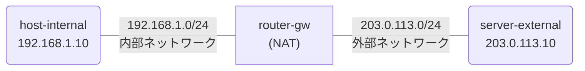

# Day 5: NAT（ネットワークアドレス変換）

## 学習目標

- NAT の概念と必要性を理解する
- VyOS で Source NAT（Masquerade）を設定できるようになる
- tcpdump でアドレス変換の様子を確認できるようになる

---

## ネットワーク構成

内部ネットワークのホストが NAT を経由して外部サーバーと通信する構成です。



### IP アドレス設計

| ノード | インターフェース | IPアドレス | 接続先 |
|--------|-----------------|-----------|--------|
| host-internal | eth1 | 192.168.1.10/24 | 内部ネットワーク |
| router-gw | eth1 | 192.168.1.1/24 | 内部ネットワーク |
| router-gw | eth2 | 203.0.113.1/24 | 外部ネットワーク |
| server-external | eth1 | 203.0.113.10/24 | 外部ネットワーク |

---

## 事前知識: NAT とは

### なぜ NAT が必要？

プライベート IP アドレス（192.168.x.x など）はインターネット上でルーティングできません。
内部ネットワークの機器がインターネットと通信するには、送信元アドレスをグローバル IP に**変換**する必要があります。

### NAT の動作

```
送信時: 内部IP(192.168.1.10) → NAT → 外部IP(203.0.113.1)
受信時: 外部IP(203.0.113.1) → NAT → 内部IP(192.168.1.10)
```

### Source NAT と Masquerade

- **Source NAT（SNAT）**: 送信元アドレスを指定した固定 IP に変換
- **Masquerade**: 送信元アドレスを送信インターフェースの IP に自動変換

家庭やオフィスのルーターで一般的に使われるのは Masquerade です。

### NAT テーブル

ルーターは「どの内部通信がどの外部アドレス/ポートに変換されたか」を記録しています。
応答パケットが返ってきたとき、このテーブルを見て元の内部ホストに転送します。

```
内部 → 外部（送信時）:
  192.168.1.10:12345 → 203.0.113.1:12345

外部 → 内部（応答時）:
  203.0.113.1:12345 → 192.168.1.10:12345
```

---

## ハンズオン

### Step 1: ラボを起動する

完成版のトポロジでラボを起動します:

```bash
cd day5-nat
sudo containerlab deploy -t topology.clab.yml
./setup-complete.sh
```

起動したら、ノードの状態を確認:
```bash
sudo containerlab inspect -t topology.clab.yml
```

### Step 2: NAT の設定を確認する

router-gw にログインして、NAT の設定を見てみましょう:

```bash
docker exec -it clab-day5-nat-router-gw /bin/vbash
```

```bash
show nat source rules
```

出力例:
```
rule 10:
  outbound-interface: eth2
  source: 192.168.1.0/24
  translation: masquerade
```

→ 内部ネットワーク（192.168.1.0/24）からの通信を、eth2 のアドレスに変換する設定

### Step 3: 内部から外部への通信を確認する

router-gw から `exit` で抜けてから、host-internal から server-external に ping:

```bash
docker exec -it clab-day5-nat-host-internal ping -c 3 203.0.113.10
```

→ NAT のおかげで通信が成功！

### Step 4: tcpdump でアドレス変換を確認する

ここが今日の最重要ポイントです。2つのターミナルを使います。

**ターミナル1**: server-external でパケットキャプチャを開始

```bash
docker exec -it clab-day5-nat-server-external /bin/sh
apk add --no-cache tcpdump
tcpdump -i eth1 icmp -n
```

**ターミナル2**: host-internal から ping を送信

```bash
docker exec -it clab-day5-nat-host-internal ping -c 3 203.0.113.10
```

ターミナル1の出力を確認:
```
IP 203.0.113.1 > 203.0.113.10: ICMP echo request
IP 203.0.113.10 > 203.0.113.1: ICMP echo reply
```

→ 送信元が `192.168.1.10` ではなく **`203.0.113.1`**（router-gw の外部 IP）に変換されている！

### Step 5: 内部側のパケットも確認する

server-external で `exit` → Ctrl+C で tcpdump を止めてから、今度は router-gw の内部側をキャプチャ:

**ターミナル1**: router-gw の内部側でキャプチャ

```bash
docker exec -it clab-day5-nat-router-gw /bin/bash
tcpdump -i eth1 icmp -n
```

**ターミナル2**: 再び ping

```bash
docker exec -it clab-day5-nat-host-internal ping -c 3 203.0.113.10
```

ターミナル1の出力:
```
IP 192.168.1.10 > 203.0.113.10: ICMP echo request
IP 203.0.113.10 > 192.168.1.10: ICMP echo reply
```

→ 内部側では元のアドレス **`192.168.1.10`** のまま！

**まとめ**: 同じ通信でも、見る場所によってアドレスが異なる

| 観測ポイント | 送信元 IP | 宛先 IP |
|-------------|----------|---------|
| 内部側（eth1） | 192.168.1.10 | 203.0.113.10 |
| 外部側（eth2） | 203.0.113.1 | 203.0.113.10 |

### Step 6: NAT テーブルを確認する

router-gw で NAT の変換テーブルを確認:

```bash
docker exec -it clab-day5-nat-router-gw /bin/vbash
show nat source translations
```

→ 現在アクティブな NAT 変換が一覧表示される

---

## 演習問題

### 問題: NAT を自分で設定してみよう

完成版を破棄して、演習用を起動:

```bash
sudo containerlab destroy -t topology.clab.yml
sudo containerlab deploy -t exercise.clab.yml
```

演習用ラボではルーターの設定が入っていません。

#### Step 1: NAT なしで通信を試す

```bash
docker exec -it clab-day5-exercise-host-internal ping -c 3 203.0.113.10
```

→ 通信失敗（server-external は応答を 192.168.1.10 に返そうとするが、ルーティングできない）

#### Step 2: router-gw を設定する

```bash
docker exec -it clab-day5-exercise-router-gw /bin/vbash
configure

# インターフェース設定
set interfaces ethernet eth1 address 192.168.1.1/24
set interfaces ethernet eth2 address 203.0.113.1/24

# Source NAT（Masquerade）を設定
set nat source rule 10 outbound-interface name eth2
set nat source rule 10 source address 192.168.1.0/24
set nat source rule 10 translation address masquerade

commit
save
exit
```

### 確認

NAT 設定後に再度 ping:

```bash
docker exec -it clab-day5-exercise-host-internal ping -c 3 203.0.113.10
```

→ 通信成功！

---

## 発展課題

### Destination NAT（ポートフォワーディング）

外部から内部サーバーにアクセスさせたい場合、Destination NAT を使います:

```bash
configure

# 外部の 203.0.113.1:8080 へのアクセスを内部の 192.168.1.10:80 に転送
set nat destination rule 10 inbound-interface name eth2
set nat destination rule 10 destination port 8080
set nat destination rule 10 protocol tcp
set nat destination rule 10 translation address 192.168.1.10
set nat destination rule 10 translation port 80

commit
save
```

テスト方法:
1. host-internal で `nc -l -p 80` を実行（簡易サーバー）
2. server-external から `nc 203.0.113.1 8080` で接続を試みる

---

## まとめ

今日学んだこと:

1. **NAT** = プライベート IP をグローバル IP に変換する技術
2. **Source NAT / Masquerade** = 送信元アドレスをルーターの外部 IP に変換
3. **tcpdump** = パケットキャプチャでアドレス変換前後を確認できる
4. **NAT テーブル** = 変換の対応関係を記録し、応答を正しく転送
5. NAT により、1つのグローバル IP で複数の内部機器がインターネット通信可能

---

## クリーンアップ

```bash
sudo containerlab destroy -t exercise.clab.yml
```
