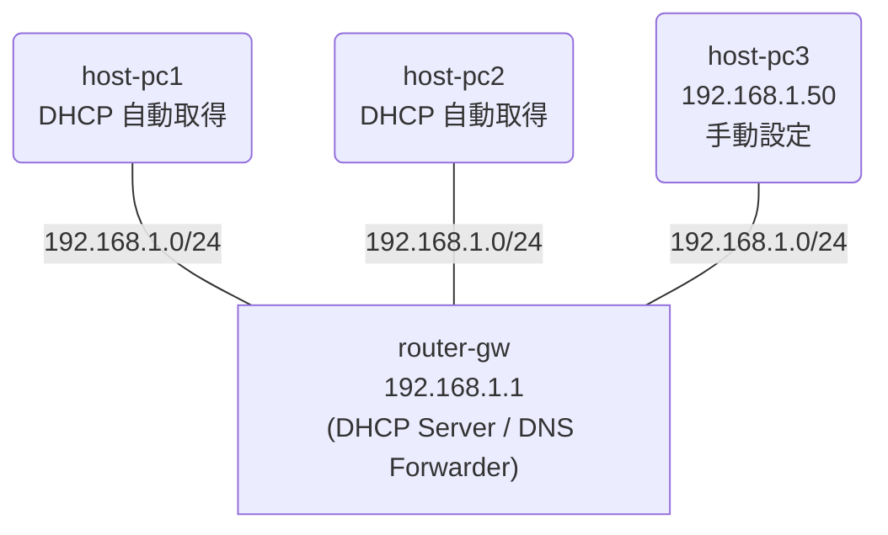

# Day 6: DHCP と DNS

## 学習目標

- DHCP によるIPアドレス自動配布の仕組みを理解する
- VyOS で DHCP サーバーを設定できるようになる
- DNS フォワーディングの基本を理解する
- 手動設定と DHCP 自動設定の違いを体験する

---

## ネットワーク構成

1台のルーターが DHCP サーバーと DNS フォワーダーを兼ねる構成です。



### IP アドレス設計

| ノード | インターフェース | IPアドレス | 取得方法 |
|--------|-----------------|-----------|---------|
| router-gw | eth1 | 192.168.1.1/24 | 手動 |
| host-pc1 | eth1 | DHCP で自動取得 | DHCP |
| host-pc2 | eth1 | DHCP で自動取得 | DHCP |
| host-pc3 | eth1 | 192.168.1.50/24 | 手動 |

### DHCP 設計

| 項目 | 値 |
|------|-----|
| DHCP プール | 192.168.1.100 〜 192.168.1.200 |
| デフォルトゲートウェイ | 192.168.1.1 |
| DNS サーバー | 192.168.1.1 |
| リース時間 | 86400 秒（24 時間） |

---

## 事前知識: DHCP とは

### DHCP（Dynamic Host Configuration Protocol）

ネットワークに接続した機器に IP アドレスを**自動的に割り当てる**プロトコル。

### DHCP がない場合

すべての機器に手動で IP アドレスを設定する必要がある:
- 設定ミスでアドレスが重複するリスク
- 機器が増えるたびに管理者が設定
- モバイルデバイスの移動に対応困難

### DHCP の動作（DORA）

```
1. Discover: クライアント → 「誰か IP をくれませんか？」（ブロードキャスト）
2. Offer:    サーバー    → 「192.168.1.100 はどうですか？」
3. Request:  クライアント → 「192.168.1.100 をください！」
4. ACK:      サーバー    → 「了解、192.168.1.100 を割り当てました」
```

### DNS フォワーディングとは

クライアントからの DNS 問い合わせを、上位の DNS サーバーに転送する機能。
ルーターが DNS の「中継役」になることで、クライアントはルーターの IP だけ知っていればよい。

---

## ハンズオン

### Step 1: ラボを起動する

完成版のトポロジでラボを起動します:

```bash
cd day6-dhcp-dns
sudo containerlab deploy -t topology.clab.yml
./setup-complete.sh
```

### Step 2: DHCP サーバーの設定を確認する

router-gw にログインして DHCP の設定を確認:

```bash
sudo docker exec -it clab-day6-dhcp-dns-router-gw /bin/vbash
```

```bash
show dhcp server leases
```

→ host-pc1 と host-pc2 に IP が割り当てられているはず

### Step 3: DHCP で取得した IP を確認する

host-pc1 の IP アドレスを確認:

```bash
sudo docker exec -it clab-day6-dhcp-dns-host-pc1 /bin/sh
ip addr show eth1
```

出力例:
```
inet 192.168.1.100/24 brd 192.168.1.255 scope global eth1
```

→ DHCP プール（192.168.1.100〜200）から自動取得されている

### Step 4: 手動設定との違いを比較する

host-pc3（手動設定）の IP アドレスを確認:

```bash
sudo docker exec -it clab-day6-dhcp-dns-host-pc3 /bin/sh
ip addr show eth1
```

出力例:
```
inet 192.168.1.50/24 scope global eth1
```

→ 手動で 192.168.1.50 が設定されている（DHCP プール範囲外）

### Step 5: ホスト間の疎通を確認する

host-pc1 から他のホストに ping:

```bash
sudo docker exec -it clab-day6-dhcp-dns-host-pc1 /bin/sh
```

```bash
# host-pc3（手動設定）への ping
ping -c 3 192.168.1.50

# router-gw への ping
ping -c 3 192.168.1.1
```

### Step 6: DNS フォワーディングを確認する

host-pc1 から DNS 問い合わせを試みます:

```bash
sudo docker exec -it clab-day6-dhcp-dns-host-pc1 /bin/sh
nslookup google.com 192.168.1.1
```

→ DNS フォワーダーが応答する（実際の名前解決はラボ環境の外部接続に依存）

---

## 演習問題

### 問題: DHCP サーバーを自分で設定してみよう

完成版を破棄して、演習用を起動:

```bash
sudo containerlab destroy -t topology.clab.yml
sudo containerlab deploy -t exercise.clab.yml
```

演習用ラボではルーターの設定が入っていません。

### router-gw の設定

```bash
sudo docker exec -it clab-day6-exercise-router-gw /bin/vbash
configure

# インターフェース設定
set interfaces ethernet eth1 address 192.168.1.1/24

# DHCP サーバー設定
set service dhcp-server shared-network-name LAN subnet 192.168.1.0/24 range 0 start 192.168.1.100
set service dhcp-server shared-network-name LAN subnet 192.168.1.0/24 range 0 stop 192.168.1.200
set service dhcp-server shared-network-name LAN subnet 192.168.1.0/24 option default-router 192.168.1.1
set service dhcp-server shared-network-name LAN subnet 192.168.1.0/24 option name-server 192.168.1.1
set service dhcp-server shared-network-name LAN subnet 192.168.1.0/24 lease 86400

# DNS フォワーディング設定
set service dns forwarding listen-address 192.168.1.1
set service dns forwarding allow-from 192.168.1.0/24
set service dns forwarding system

commit
save
exit
```

### DHCP クライアントで IP を取得する

設定完了後、各ホストで DHCP リクエストを実行:

```bash
# host-pc1
sudo docker exec -it clab-day6-exercise-host-pc1 udhcpc -i eth1

# host-pc2
sudo docker exec -it clab-day6-exercise-host-pc2 udhcpc -i eth1
```

### 確認

1. host-pc1 と host-pc2 に IP アドレスが割り当てられたか確認:
   ```bash
   sudo docker exec clab-day6-exercise-host-pc1 ip addr show eth1
   sudo docker exec clab-day6-exercise-host-pc2 ip addr show eth1
   ```

2. DHCP リース情報を確認:
   ```bash
   sudo docker exec -it clab-day6-exercise-router-gw /bin/vbash
   show dhcp server leases
   ```

3. ホスト間で ping が通るか確認:
   ```bash
   sudo docker exec clab-day6-exercise-host-pc1 ping -c 3 192.168.1.50
   ```

---

## 発展課題

### DHCP 固定割り当て（スタティックマッピング）

特定の機器に常に同じ IP を割り当てたい場合:

```bash
configure

# host-pc1 の MAC アドレスを確認してから設定
set service dhcp-server shared-network-name LAN subnet 192.168.1.0/24 static-mapping pc1 ip-address 192.168.1.101
set service dhcp-server shared-network-name LAN subnet 192.168.1.0/24 static-mapping pc1 mac-address <host-pc1のMACアドレス>

commit
save
```

MAC アドレスの確認方法:
```bash
sudo docker exec clab-day6-exercise-host-pc1 ip link show eth1
```

---

## まとめ

今日学んだこと:

1. **DHCP** = IP アドレスを自動配布するプロトコル
2. **DORA** = Discover → Offer → Request → ACK の 4 ステップ
3. **DHCP プール** = 自動割り当て用の IP 範囲
4. **DNS フォワーディング** = DNS 問い合わせを上位サーバーに転送
5. **手動 vs DHCP** = 固定が必要なサーバーは手動、クライアントは DHCP が一般的

---

## クリーンアップ

```bash
sudo containerlab destroy -t exercise.clab.yml
```
