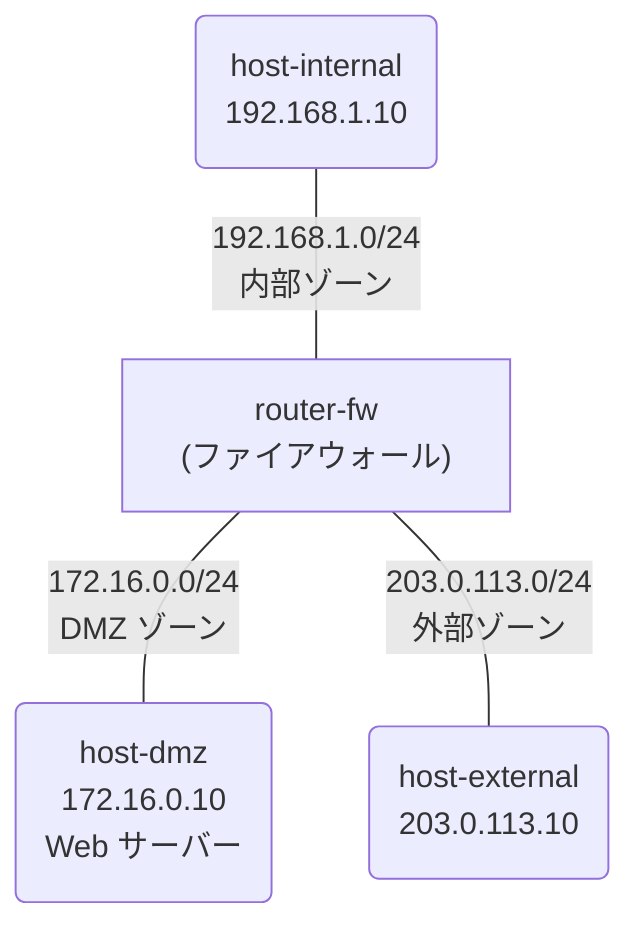

# Day 7: ファイアウォール

## 学習目標

- ファイアウォールの概念とゾーンの考え方を理解する
- VyOS でパケットフィルタリングルールを設定できるようになる
- 「許可」「拒否」の制御を nc コマンドで検証できるようになる

---

## ネットワーク構成

3つのゾーン（内部 / DMZ / 外部）を持つファイアウォール構成です。



### IP アドレス設計

| ノード | インターフェース | IPアドレス | ゾーン |
|--------|-----------------|-----------|--------|
| host-internal | eth1 | 192.168.1.10/24 | 内部 |
| router-fw | eth1 | 192.168.1.1/24 | 内部 |
| router-fw | eth2 | 172.16.0.1/24 | DMZ |
| router-fw | eth3 | 203.0.113.1/24 | 外部 |
| host-dmz | eth1 | 172.16.0.10/24 | DMZ |
| host-external | eth1 | 203.0.113.10/24 | 外部 |

### ファイアウォールポリシー

| 通信方向 | ポリシー |
|---------|---------|
| 内部 → 外部 | 許可（すべて） |
| 内部 → DMZ | 許可（すべて） |
| 外部 → DMZ | HTTP（TCP 80）のみ許可 |
| 外部 → 内部 | 拒否 |
| DMZ → 内部 | 拒否 |
| DMZ → 外部 | 拒否 |

---

## 事前知識: ファイアウォールとは

### ファイアウォールの役割

ネットワーク間を流れる通信を**検査し、許可または拒否**する仕組み。

### ゾーンの考え方

ネットワークをセキュリティレベルで分類:

```
┌──────────────────────────────────────────┐
│ 内部ゾーン（Trust）                        │
│   社内 PC、機密データ                      │
│   → 最も信頼度が高い                       │
├──────────────────────────────────────────┤
│ DMZ ゾーン（Semi-Trust）                   │
│   Web サーバー、メールサーバー              │
│   → 外部に公開するが、内部とは分離           │
├──────────────────────────────────────────┤
│ 外部ゾーン（Untrust）                      │
│   インターネット                           │
│   → 信頼度が最も低い                       │
└──────────────────────────────────────────┘
```

### パケットフィルタリングの基本

ファイアウォールは以下の情報でフィルタリング:

- **送信元/宛先 IP アドレス**
- **プロトコル**（TCP, UDP, ICMP）
- **ポート番号**（HTTP=80, HTTPS=443, SSH=22）
- **通信の状態**（新規, 確立済み, 関連）

### デフォルトポリシー

- **ホワイトリスト方式**: デフォルト拒否、明示的に許可（推奨）
- **ブラックリスト方式**: デフォルト許可、明示的に拒否

---

## ハンズオン

### Step 1: ラボを起動する

完成版のトポロジでラボを起動します:

```bash
cd day7-firewall
sudo containerlab deploy -t topology.clab.yml
./setup-complete.sh
```

### Step 2: ファイアウォールルールを確認する

router-fw にログインしてファイアウォール設定を確認:

```bash
sudo docker exec -it clab-day7-firewall-router-fw /bin/vbash
```

```bash
show firewall
```

### Step 3: 許可された通信をテストする

#### 内部 → 外部（ping: 許可）

```bash
sudo docker exec -it clab-day7-firewall-host-internal ping -c 3 203.0.113.10
```

→ 成功（内部から外部への通信はすべて許可）

#### 外部 → DMZ の HTTP（TCP 80: 許可）

まず、DMZ で簡易 Web サーバーを起動します:

**ターミナル1**: host-dmz で HTTP サーバーを起動

```bash
sudo docker exec -it clab-day7-firewall-host-dmz /bin/sh
while true; do echo -e "HTTP/1.0 200 OK\r\n\r\nHello from DMZ" | nc -l -p 80; done
```

**ターミナル2**: host-external から HTTP アクセス

```bash
sudo docker exec -it clab-day7-firewall-host-external /bin/sh
nc -w 3 172.16.0.10 80
```

→ "Hello from DMZ" が表示される（HTTP 許可）

### Step 4: 拒否された通信をテストする

#### 外部 → 内部（ping: 拒否）

```bash
sudo docker exec -it clab-day7-firewall-host-external ping -c 3 -W 2 192.168.1.10
```

→ 失敗（外部から内部への通信は拒否）

#### 外部 → DMZ の SSH（TCP 22: 拒否）

**ターミナル1**: host-dmz でポート 22 をリッスン

```bash
sudo docker exec -it clab-day7-firewall-host-dmz /bin/sh
nc -l -p 22
```

**ターミナル2**: host-external からポート 22 に接続を試みる

```bash
sudo docker exec -it clab-day7-firewall-host-external /bin/sh
nc -w 3 172.16.0.10 22
```

→ 接続失敗（HTTP 以外は拒否）

### Step 5: ステートフルインスペクションを理解する

内部から外部への通信が許可されている場合、**応答パケットは自動的に許可**されます。
これがステートフル（状態追跡型）ファイアウォールの仕組みです。

```
1. host-internal → host-external: SYN（新規接続）→ ルール10で許可
2. host-external → host-internal: SYN-ACK（応答）→ ステート追跡で自動許可
3. host-internal → host-external: ACK → ステート追跡で自動許可
```

→ 明示的に「外部→内部」を許可しなくても、内部から始めた通信の応答は通る

---

## 演習問題

### 問題: ファイアウォールを自分で設定してみよう

完成版を破棄して、演習用を起動:

```bash
sudo containerlab destroy -t topology.clab.yml
sudo containerlab deploy -t exercise.clab.yml
```

### router-fw の設定

```bash
sudo docker exec -it clab-day7-exercise-router-fw /bin/vbash
configure

# インターフェース設定
set interfaces ethernet eth1 address 192.168.1.1/24
set interfaces ethernet eth2 address 172.16.0.1/24
set interfaces ethernet eth3 address 203.0.113.1/24

# デフォルトポリシー: すべて拒否
set firewall ipv4 forward filter default-action drop

# ルール 1: 確立済み・関連通信を許可（ステートフル）
set firewall ipv4 forward filter rule 1 action accept
set firewall ipv4 forward filter rule 1 state established
set firewall ipv4 forward filter rule 1 state related

# ルール 10: 内部 → 外部を許可
set firewall ipv4 forward filter rule 10 action accept
set firewall ipv4 forward filter rule 10 inbound-interface name eth1
set firewall ipv4 forward filter rule 10 outbound-interface name eth3

# ルール 20: 内部 → DMZ を許可
set firewall ipv4 forward filter rule 20 action accept
set firewall ipv4 forward filter rule 20 inbound-interface name eth1
set firewall ipv4 forward filter rule 20 outbound-interface name eth2

# ルール 30: 外部 → DMZ の HTTP（TCP 80）のみ許可
set firewall ipv4 forward filter rule 30 action accept
set firewall ipv4 forward filter rule 30 inbound-interface name eth3
set firewall ipv4 forward filter rule 30 outbound-interface name eth2
set firewall ipv4 forward filter rule 30 protocol tcp
set firewall ipv4 forward filter rule 30 destination port 80

commit
save
exit
```

### 確認

以下をすべて検証してください:

```bash
# 1. 内部 → 外部（許可されるはず）
sudo docker exec clab-day7-exercise-host-internal ping -c 3 203.0.113.10

# 2. 外部 → 内部（拒否されるはず）
sudo docker exec clab-day7-exercise-host-external ping -c 3 -W 2 192.168.1.10

# 3. 外部 → DMZ の TCP 80（許可されるはず）
# ターミナル1: sudo docker exec -it clab-day7-exercise-host-dmz sh -c 'while true; do echo -e "HTTP/1.0 200 OK\r\n\r\nHello" | nc -l -p 80; done'
# ターミナル2: sudo docker exec clab-day7-exercise-host-external sh -c 'echo "GET /" | nc -w 3 172.16.0.10 80'
```

---

## 発展課題

### ICMP（ping）の制御

外部から DMZ への ping だけ許可したい場合:

```bash
configure

set firewall ipv4 forward filter rule 35 action accept
set firewall ipv4 forward filter rule 35 inbound-interface name eth3
set firewall ipv4 forward filter rule 35 outbound-interface name eth2
set firewall ipv4 forward filter rule 35 protocol icmp

commit
save
```

### ログの有効化

拒否された通信をログに記録:

```bash
configure

set firewall ipv4 forward filter default-log

commit
save
```

---

## まとめ

今日学んだこと:

1. **ファイアウォール** = ネットワーク間の通信を制御する仕組み
2. **ゾーン** = 内部（Trust）/ DMZ / 外部（Untrust）のセキュリティ分類
3. **デフォルト拒否 + 明示許可** = ホワイトリスト方式が安全
4. **ステートフル** = 確立済みの通信は自動的に応答を許可
5. **nc コマンド** = 特定ポートの通信テストに便利

---

## クリーンアップ

```bash
sudo containerlab destroy -t exercise.clab.yml
```
