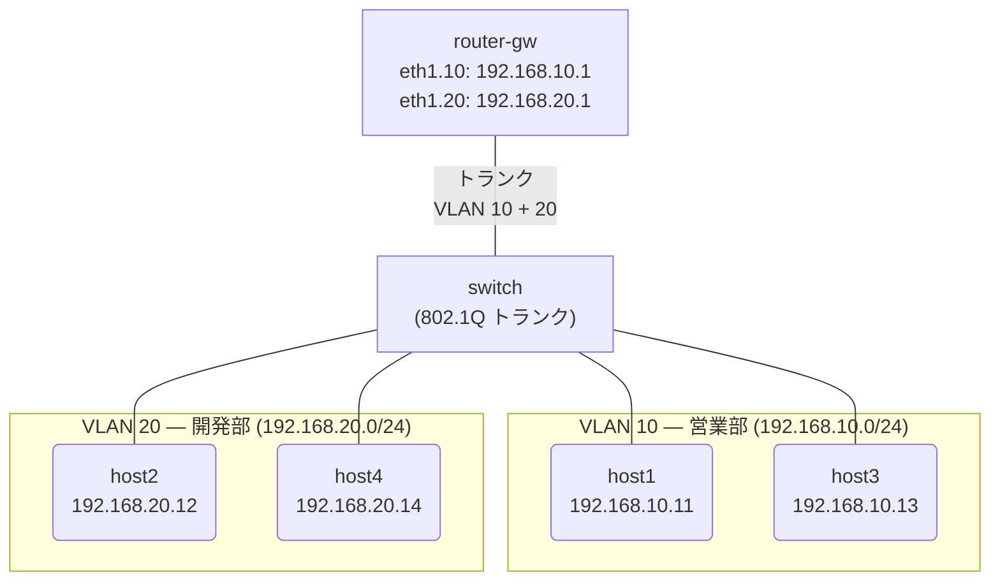

# Day 8: Inter-VLAN ルーティング

## 学習目標

- VLAN 間通信にルーターが必要な理由を理解する
- 802.1Q タグ VLAN（トランクポート）の仕組みを学ぶ
- VyOS のサブインターフェースで VLAN 間ルーティングを設定できるようになる

---

## ネットワーク構成

Day 3 の VLAN 構成に VyOS ルーターを追加し、VLAN 間の通信を実現する「ルーター・オン・ア・スティック」構成です。



### IP アドレス設計

| ノード | インターフェース | IPアドレス | VLAN |
|--------|-----------------|-----------|------|
| router-gw | eth1.10 | 192.168.10.1/24 | 10 |
| router-gw | eth1.20 | 192.168.20.1/24 | 20 |
| host1 | eth1 | 192.168.10.11/24 | 10 |
| host3 | eth1 | 192.168.10.13/24 | 10 |
| host2 | eth1 | 192.168.20.12/24 | 20 |
| host4 | eth1 | 192.168.20.14/24 | 20 |

---

## 事前知識: Inter-VLAN ルーティング

### Day 3 のおさらい

Day 3 では VLAN でネットワークを分離しました。同じ VLAN 内では通信できますが、**異なる VLAN 間では通信できません**。

```
VLAN 10 (営業部) ←×→ VLAN 20 (開発部)
```

### VLAN 間通信が必要な場面

- 営業部から開発部のファイルサーバーにアクセスしたい
- 管理者がすべての VLAN の機器を管理したい
- 特定の VLAN 間だけ通信を許可したい

### ルーター・オン・ア・スティック

1本の物理リンクで複数の VLAN を扱う構成:

```
[スイッチ] ====トランク==== [ルーター]
  ├─ VLAN 10                 ├─ eth1.10 (VLAN 10)
  └─ VLAN 20                 └─ eth1.20 (VLAN 20)
```

- **トランクポート**: 802.1Q タグ付きフレームを運ぶ
- **サブインターフェース**: 物理インターフェース上に VLAN ごとの仮想インターフェースを作成

### 802.1Q タグ

イーサネットフレームに VLAN ID を埋め込む規格:

```
通常のフレーム:
[宛先MAC][送信元MAC][タイプ][データ]

802.1Q タグ付きフレーム:
[宛先MAC][送信元MAC][802.1Q: VLAN 10][タイプ][データ]
```

---

## ハンズオン

### Step 1: ラボを起動する

完成版のトポロジでラボを起動します:

```bash
cd day8-intervlan-routing
sudo containerlab deploy -t topology.clab.yml
./setup-complete.sh
```

### Step 2: VLAN 分離を確認する

まず、同じ VLAN 内の通信を確認:

```bash
docker exec -it clab-day8-intervlan-routing-host1 /bin/sh
```

```bash
# 同じ VLAN 10 の host3 → 成功
ping -c 2 192.168.10.13
```

### Step 3: VLAN 間通信を確認する

異なる VLAN への通信（ルーター経由）:

```bash
# 異なる VLAN 20 の host2 → ルーター経由で成功！
ping -c 2 192.168.20.12
```

→ Day 3 では不可能だった VLAN 間通信が、ルーターにより可能に！

traceroute で経路を確認:

```bash
traceroute 192.168.20.12
```

出力例:
```
1  192.168.10.1 (router-gw)  ← VLAN 10 のゲートウェイ
2  192.168.20.12 (host2)     ← VLAN 20 のホスト
```

→ ルーターを経由していることがわかる

### Step 4: スイッチのトランクポートを確認する

host1 から `exit` で抜けてから、スイッチにログインしてブリッジ構成を確認:

```bash
docker exec -it clab-day8-intervlan-routing-switch /bin/sh
```

```bash
# VLAN サブインターフェースの確認
ip link show type vlan

# ブリッジごとのポート割り当て
ip link show master br-vlan10
ip link show master br-vlan20
```

→ eth5.10 と eth5.20 がトランクポートの VLAN サブインターフェース

### Step 5: VyOS のサブインターフェースを確認する

switch から `exit` で抜けてから、router-gw にログイン:

```bash
docker exec -it clab-day8-intervlan-routing-router-gw /bin/vbash
```

```bash
show interfaces
```

出力例:
```
Interface        IP Address            S/L
---------        ----------            ---
eth1             -                     u/u
eth1.10          192.168.10.1/24       u/u
eth1.20          192.168.20.1/24       u/u
```

→ 1つの物理インターフェース（eth1）上に、2つの VLAN サブインターフェースが存在

```bash
show ip route
```

→ 192.168.10.0/24 と 192.168.20.0/24 が Connected として認識されている

---

## 演習問題

### 問題: VLAN 間ルーティングを自分で設定してみよう

完成版を破棄して、演習用を起動:

```bash
sudo containerlab destroy -t topology.clab.yml
sudo containerlab deploy -t exercise.clab.yml
```

演習用ラボでは、スイッチは1つのブリッジ（VLAN 分離なし）、ルーターは未設定です。

### Step 1: スイッチで VLAN を分離する（Day 3 の復習）

```bash
docker exec -it clab-day8-exercise-switch /bin/sh

# 現在のブリッジからポートを外す
ip link set eth1 nomaster
ip link set eth2 nomaster
ip link set eth3 nomaster
ip link set eth4 nomaster

# VLAN 10 用ブリッジ
ip link add br-vlan10 type bridge
ip link set br-vlan10 up

# VLAN 20 用ブリッジ
ip link add br-vlan20 type bridge
ip link set br-vlan20 up

# アクセスポート割り当て
ip link set eth1 master br-vlan10   # host1
ip link set eth3 master br-vlan10   # host3
ip link set eth2 master br-vlan20   # host2
ip link set eth4 master br-vlan20   # host4
```

### Step 2: トランクポートを設定する

引き続きスイッチで、ルーターへのトランクポートを設定:

```bash
# eth5 上に VLAN タグ付きサブインターフェースを作成
ip link add link eth5 name eth5.10 type vlan id 10
ip link add link eth5 name eth5.20 type vlan id 20

# 各 VLAN ブリッジにトランクサブインターフェースを追加
ip link set eth5.10 master br-vlan10
ip link set eth5.20 master br-vlan20

# リンクを UP
ip link set eth5 up
ip link set eth5.10 up
ip link set eth5.20 up

exit
```

### Step 3: VyOS でサブインターフェースを設定する

```bash
docker exec -it clab-day8-exercise-router-gw /bin/vbash
configure

# VLAN 10 サブインターフェース
set interfaces ethernet eth1 vif 10 address 192.168.10.1/24

# VLAN 20 サブインターフェース
set interfaces ethernet eth1 vif 20 address 192.168.20.1/24

commit
save
exit
```

### 確認

```bash
# 同じ VLAN 内（host1 → host3: 成功するはず）
docker exec clab-day8-exercise-host1 ping -c 3 192.168.10.13

# 異なる VLAN 間（host1 → host2: ルーター経由で成功するはず）
docker exec clab-day8-exercise-host1 ping -c 3 192.168.20.12

# 経路確認
docker exec clab-day8-exercise-host1 traceroute 192.168.20.12
```

---

## 発展課題

### VLAN 間のアクセス制御

Day 7 で学んだファイアウォールを組み合わせて、特定の VLAN 間通信だけを制御:

```bash
configure

# VLAN 20 → VLAN 10 の通信を拒否（開発部 → 営業部）
set firewall ipv4 forward filter default-action accept
set firewall ipv4 forward filter rule 10 action drop
set firewall ipv4 forward filter rule 10 source address 192.168.20.0/24
set firewall ipv4 forward filter rule 10 destination address 192.168.10.0/24

commit
save
```

---

## まとめ

今日学んだこと:

1. **Inter-VLAN ルーティング** = 異なる VLAN 間の通信にルーターが必要
2. **ルーター・オン・ア・スティック** = 1本のトランクリンクで複数 VLAN を扱う構成
3. **802.1Q** = フレームに VLAN ID タグを付加する規格
4. **サブインターフェース** = `eth1.10`, `eth1.20` のように VLAN ごとの仮想インターフェース
5. **トランクポート** = 複数の VLAN タグ付きフレームを運ぶポート

---

## クリーンアップ

```bash
sudo containerlab destroy -t exercise.clab.yml
```
