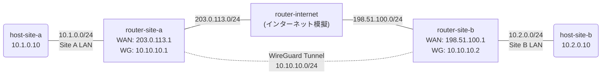

# Day 9: VPN（WireGuard）

## 学習目標

- VPN の概念と必要性を理解する
- WireGuard の仕組み（公開鍵暗号、トンネル）を学ぶ
- VyOS で WireGuard VPN を設定して拠点間接続を実現する

---

## ネットワーク構成

2つの拠点がインターネット経由で WireGuard VPN トンネルを張る構成です。



### IP アドレス設計

| ノード | インターフェース | IPアドレス | 接続先 |
|--------|-----------------|-----------|--------|
| host-site-a | eth1 | 10.1.0.10/24 | Site A LAN |
| router-site-a | eth1 | 10.1.0.1/24 | Site A LAN |
| router-site-a | eth2 | 203.0.113.1/24 | WAN（インターネット） |
| router-site-a | wg0 | 10.10.10.1/24 | WireGuard トンネル |
| router-internet | eth1 | 203.0.113.254/24 | WAN（Site A 側） |
| router-internet | eth2 | 198.51.100.254/24 | WAN（Site B 側） |
| router-site-b | eth1 | 198.51.100.1/24 | WAN（インターネット） |
| router-site-b | eth2 | 10.2.0.1/24 | Site B LAN |
| router-site-b | wg0 | 10.10.10.2/24 | WireGuard トンネル |
| host-site-b | eth1 | 10.2.0.10/24 | Site B LAN |

---

## 事前知識: VPN とは

### VPN（Virtual Private Network）

公衆ネットワーク（インターネット）上に**暗号化されたトンネル**を作り、あたかも専用線で接続されているかのようにプライベート通信を行う技術。

### なぜ VPN が必要？

```
NAT なし:
  [Site A: 10.1.0.0/24] ←×→ インターネット ←×→ [Site B: 10.2.0.0/24]
  プライベート IP 同士は直接通信できない

VPN あり:
  [Site A: 10.1.0.0/24] ←──暗号化トンネル──→ [Site B: 10.2.0.0/24]
  トンネル内ではプライベート IP で通信可能
```

### WireGuard とは

最新世代の VPN プロトコル:

- **シンプル**: 設定がとても簡単（数行で完了）
- **高速**: カーネル内で動作し、IPsec より高速
- **安全**: 最新の暗号アルゴリズムのみ使用
- **公開鍵認証**: SSH のように鍵ペアで認証

### WireGuard の鍵ペア

```
各拠点で鍵ペアを生成:
  Site A: 秘密鍵A + 公開鍵A
  Site B: 秘密鍵B + 公開鍵B

Site A には Site B の公開鍵を登録
Site B には Site A の公開鍵を登録

→ 互いの公開鍵を知っていれば暗号化通信が成立
```

---

## ハンズオン

### Step 1: ラボを起動する

完成版のトポロジでラボを起動します:

```bash
cd day9-vpn
sudo containerlab deploy -t topology.clab.yml
./setup-complete.sh
```

> setup-complete.sh が WireGuard の鍵生成と設定を自動で行います。

### Step 2: WireGuard インターフェースを確認する

router-site-a にログイン:

```bash
docker exec -it clab-day9-vpn-router-site-a /bin/vbash
```

```bash
show interfaces
```

出力例:
```
Interface        IP Address            S/L
---------        ----------            ---
eth1             10.1.0.1/24           u/u
eth2             203.0.113.1/24        u/u
wg0              10.10.10.1/24         u/u   ← WireGuard トンネル
```

WireGuard の詳細を確認:
```bash
show interfaces wireguard wg0
```

### Step 3: VPN トンネル越しの疎通確認

router-site-a から `exit` で抜けてから、host-site-a から host-site-b に ping:

```bash
docker exec -it clab-day9-vpn-host-site-a /bin/sh
```

```bash
# Site B の LAN への ping（VPN トンネル経由）
ping -c 3 10.2.0.10
```

→ VPN トンネル経由で通信成功！

traceroute で経路を確認:

```bash
traceroute 10.2.0.10
```

出力例:
```
1  10.1.0.1 (router-site-a)
2  10.10.10.2 (router-site-b via WireGuard)
3  10.2.0.10 (host-site-b)
```

→ インターネット上のルーター（router-internet）は見えない（トンネル内部を通過）

### Step 4: WAN 側のパケットを確認する

VPN の暗号化を確認するために、WAN 側でパケットキャプチャを行います。

**ターミナル1**: router-internet でキャプチャ

```bash
docker exec -it clab-day9-vpn-router-internet /bin/sh
apk add --no-cache tcpdump
tcpdump -i eth1 -n
```

**ターミナル2**: host-site-a から ping

```bash
docker exec clab-day9-vpn-host-site-a ping -c 3 10.2.0.10
```

ターミナル1 の出力:
```
IP 203.0.113.1.51820 > 198.51.100.1.51820: UDP, length ...
```

→ WAN 側では **UDP ポート 51820** の暗号化パケットしか見えない！
→ 中身（10.1.0.10 → 10.2.0.10 の ping）は暗号化されて読めない

### Step 5: WireGuard のピア情報を確認する

router-site-a で WireGuard のピア（接続相手）情報を確認:

```bash
docker exec -it clab-day9-vpn-router-site-a /bin/vbash
show wireguard peers
```

---

## 演習問題

### 問題: WireGuard VPN を自分で設定してみよう

完成版を破棄して、演習用を起動:

```bash
sudo containerlab destroy -t topology.clab.yml
sudo containerlab deploy -t exercise.clab.yml
```

演習用ラボではルーターの設定が入っていません（インターネットルーターのみ設定済み）。

### Step 1: WireGuard 鍵ペアを生成する

各拠点ルーターで鍵ペアを生成します。

**router-site-a:**
```bash
docker exec clab-day9-exercise-router-site-a bash -c "wg genkey | tee /tmp/site-a-private | wg pubkey > /tmp/site-a-public"
SITE_A_PUBKEY=$(docker exec clab-day9-exercise-router-site-a cat /tmp/site-a-public)
SITE_A_PRIVKEY=$(docker exec clab-day9-exercise-router-site-a cat /tmp/site-a-private)
echo "Site A Public Key: $SITE_A_PUBKEY"
```

**router-site-b:**
```bash
docker exec clab-day9-exercise-router-site-b bash -c "wg genkey | tee /tmp/site-b-private | wg pubkey > /tmp/site-b-public"
SITE_B_PUBKEY=$(docker exec clab-day9-exercise-router-site-b cat /tmp/site-b-public)
SITE_B_PRIVKEY=$(docker exec clab-day9-exercise-router-site-b cat /tmp/site-b-private)
echo "Site B Public Key: $SITE_B_PUBKEY"
```

### Step 2: router-site-a を設定する

```bash
docker exec -it clab-day9-exercise-router-site-a /bin/vbash
configure

# インターフェース設定
set interfaces ethernet eth1 address 10.1.0.1/24
set interfaces ethernet eth2 address 203.0.113.1/24

# インターネットへの経路
set protocols static route 198.51.100.0/24 next-hop 203.0.113.254

# WireGuard 設定
set interfaces wireguard wg0 address 10.10.10.1/24
set interfaces wireguard wg0 port 51820
set interfaces wireguard wg0 private-key <Site A の秘密鍵>
set interfaces wireguard wg0 peer site-b public-key <Site B の公開鍵>
set interfaces wireguard wg0 peer site-b allowed-ips 10.2.0.0/24
set interfaces wireguard wg0 peer site-b allowed-ips 10.10.10.2/32
set interfaces wireguard wg0 peer site-b endpoint 198.51.100.1:51820

# Site B LAN への経路
set protocols static route 10.2.0.0/24 next-hop 10.10.10.2

commit
save
exit
```

### Step 3: router-site-b を設定する

自分で考えて設定してみてください！

ヒント:
- eth1: 198.51.100.1/24（WAN）
- eth2: 10.2.0.1/24（LAN）
- wg0: 10.10.10.2/24
- ポート: 51820
- ピア: site-a の公開鍵、endpoint 203.0.113.1:51820
- allowed-ips: 10.1.0.0/24, 10.10.10.1/32
- スタティックルート: 10.1.0.0/24 → 10.10.10.1

### 確認

```bash
# Site A → Site B（VPN 経由）
docker exec clab-day9-exercise-host-site-a ping -c 3 10.2.0.10

# Site B → Site A
docker exec clab-day9-exercise-host-site-b ping -c 3 10.1.0.10
```

---

## まとめ

今日学んだこと:

1. **VPN** = 公衆ネットワーク上に暗号化トンネルを構築する技術
2. **WireGuard** = シンプル・高速・安全な最新 VPN プロトコル
3. **公開鍵認証** = 鍵ペア（秘密鍵 + 公開鍵）で相互認証
4. **トンネル** = VPN 内ではプライベート IP で直接通信
5. **WAN 側の暗号化** = tcpdump で見ても UDP パケットとしか見えない

---

## クリーンアップ

```bash
sudo containerlab destroy -t exercise.clab.yml
```
